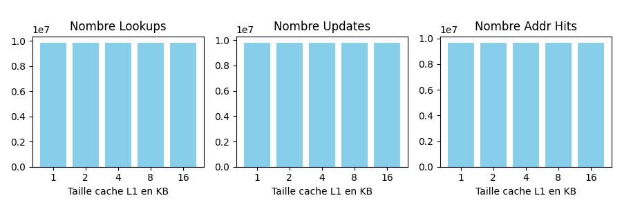
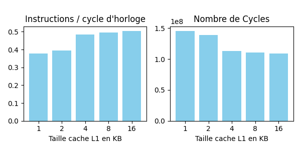
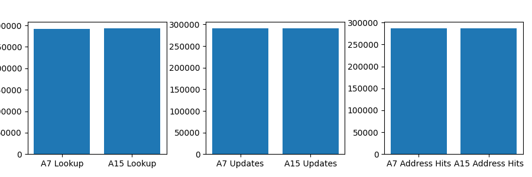
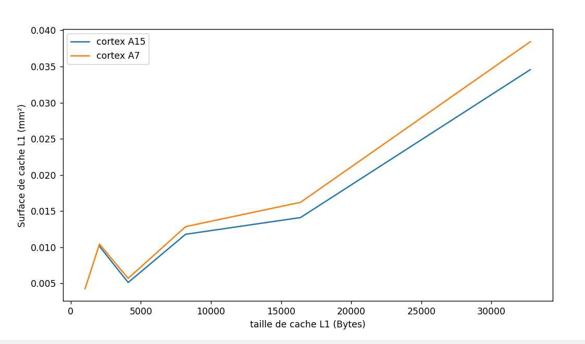

# Compte Rendu TP4 ES201
## Jean Acker ; Alexandre Drean ; Mathias Gilbert ; Edouard Clocheret


## Question 1 :

### Pour le benchmark Blowfish

**pour lancer le profiling**

```
sim-profile -redir:sim ./profiling -iclass true -iprof true bf.ss e input_small.asc output.enc 123456789abcdeffedcba0987654321
```
les résultats sont chargés dans le fichier profiling, les lignes qui nous intéressent sont les suivantes:


>sim_inst_class_prof.start_dist
>load                 535756  21.32 
>store                179590   7.15 
>uncond branch         69208   2.75 
>cond branch          221901   8.83 
>int computation     1506430  59.95 
>fp computation            0   0.00 
>trap                     23   0.00 
>sim_inst_class_prof.end_dist

(compris entre les lignes 61 et 69)

Et les lignes 136 à 145 qui correspondent aux additions, soustraction, multiplication et division. à chaque fois on regarde la dernière colonne qui correspond à la proportion de ce type d'instruction. Parmi les lignes 136 à 145, on retrouve :
 - add, addi, addu, addiu qui sont juste des additions, la différence entre ces 4 opérations, c'est le types des arguments, par exemple addu prend des entiers unsigned
 enfait,ce qui nous interesse, c'est la proportion des additions (lignes 136 à 139), la proporiton des soustraction (140 et 141)...

 C'est important parceque on peut spécifier le nombre de multiplieurs/diviseurs entiers et flottant du processeur qu'on construit. Historiquement, les ALUs ne pouvaient faire que des  additions et soustractions, et il peut y avoir des unité spécialisé pour la division et la multipication.
 

**détaille des classes d'instruction**

- load : le nombre de chargement depuis la mémoire
- store : le nombre de chargement dans la mémoire
- uncond branch : le nombre de jump dans les instructions
- cond branch : le nombre de branchement conditionel
- int computation : le nombre de calcul en nombre entier
- fp computation : le nombre de calcul en nombre flottant
- trap : un trap c'est un interruption, typiquement quand il y a une erreur, une division par zéro, un *interrupt handler* s'occupent de ce genre d'événement

Tableau retraçant l'utilisation des différentes opérations : 


| Opération | Pourcentage d'utilisation |
|:----------|:-------------------------:|
| load | 21.32 |
| store | 7.15 |
| uncond branch | 2.75 |
| cond branch | 8.83 |
| int computation | 59.95 |
| fp computation | 0.00 |
| trap | 0.00 |

| Opération | Pourcentage d'utilisation |
|:----------|:-------------------------:|
| add | 0.00 |
| addi | 0.00 |
| addu | 15.92 |
| addiu | 11.14 |
| sub | 0.00 |
| subu | 0.00 |
| mult | 0.00 |
| multu | 0.00 |
| div | 0.00 |
| divu | 0.00 |
<div style="text-align:center;">
  
</div>
On remarque que les opérations les plus fréquemment appelées sont les additions d'entiers non signés. Les autres opérations ne sont, hormis la soustraction d'entiers non-signés "subu" qui est appelée un nombre de fois négligeable, même pas appelées du tout.

Maintenant voyons quels résulats l'on obtient avec le profiling avec l'algorithme de Dijkstra :

### Pour le benchmark dijkstra

**Pour lancer le profiling**

```
sim-profile -redir:sim ./profiling_dij -iclass true -iprof true dijkstra_small.ss input.dat et bf.ss input_small.asc
```

| Opération | Pourcentage d'utilisation |
|:----------|:-------------------------:|
| load | 24.13 |
| store | 10.34 |
| uncond branch | 1.06 |
| cond branch | 14.69 |
| int computation | 49.77 |
| fp computation | 0.00 |
| trap | 0.00 |

Bien que le résultat soit un peu plus équilibré, les opérations d'addition d'entiers non-signés restent largement majoritaires.


## Question 2 :

Dans le cas de blowfish, les instructions majoritaires sont les écritures mémoires (41%) et les calculs en nombre entier (35%). Les branchements conditionelles occupent près de 12\% des instructions et les chargements depuis la mémoire 8%. Le profiling de dijkstra est assez simialaire, avec cette fois plus de chargement depuis la mémoire que d'écriture. Pour obtenir de meilleure performances, il serait judicieux de multiplier les ALUs pour paralléliser les calculs entier, et d'avoir un bon prédicteur de branchement. Le grand nombre d'accès mémoire reste néanmoins un problème.

## Question 3 :

Comparons les résultats précédents avec 3 profilings supplémentaires : SSCA2-BCH, SHA-1 et le produit de polynômes.


**Pour le benchmark SSCA2**

```
sim-profile -redir:sim ./profiling_SSCA -iclass true -iprof true SSCA2.ss input_small.asc
```

**Pour le benchmark SHA**

```
sim-profile -redir:sim ./profiling_SHA -iclass true -iprof true sha.ss input_small.asc
```

**Pour le produit de polynôme**

`sim-profile -redir:sim ./profiling_POLY -iclass true -iprof true poly_mult.ss`

Voici les résultats pour le profiling de SSCA2-BCH :

| Opération | Pourcentage d'utilisation |
|:----------|:-------------------------:|
| load | 24.13 |
| store | 10.34 |
| uncond branch | 1.06 |
| cond branch | 14.69 |
| int computation | 49.77 |
| fp computation | 0.00 |
| trap | 0.00 |

Voici les résultats du profiling pour SHA-1
| Opération | Pourcentage d'utilisation |
|:----------|:-------------------------:|
| load | 16.72 |
| store | 8.12 |
| uncond branch | 0.08 |
| cond branch | 6.10 |
| int computation | 68.99 |
| fp computation | 0.00 |
| trap | 0.00 |

Voici les résultats du profiling pour le produit de pôlynomes :

| Opération | Pourcentage d'utilisation |
|:----------|:-------------------------:|
| load | 23.06 |
| store | 7.71 |
| uncond branch | 0.00 |
| cond branch | 7.70 |
| int computation | 46.16 |
| fp computation | 15.37 |
| trap | 0.00 |

On remarque que ces 5 benchmarks ont tous une répartition des classes d'instruction similaire, avec une majorité d'opérations en nombre entier, et une grande part d'accès mémoire et de branchements conditionels. On remarquera que la multiplication de polynôme requiert également - et à la différence des autres benchmark- une grande part de calcul en nombres flottants (15%), ainsi qu'une part conséquente de soustraction de nombres entiers non-signés.

## Question 4 :

### utilisation de sim-outorder : 

```
sim-outorder -redir:sim ./sim_dij -fetch:ifqsize 8 -decode:width 4 -issue:inorder false -issue:width 8 -commit:width 4 -ruu:size 16 -lsq:size 16 -res:imult 1 -res:ialu 5 -res:fpalu 1 -res:fpmult 1 -bpred:2lev 1 1024 8 0 -bpred:btb 256 2 -bpred:comb 1024 -fetch:mplat 15 -cache:dl1 dl1:32:64:2:l -cache:il1 il1:32:64:2:l -cache:dl2 ul2:512:64:16:l  dijkstra_small.ss input.dat et bf.ss input_small.asc
```

*Remarque* : les paramètres pour les prédicteurs de branchement sont ceux par défaut, à l'exception du premier paramètre pour le btb qui est indiqué dans le tableau

Dans un premier temps listons les différents paramètres clefs ressortant des simulations sim-outorder. Les valeurs associées aux paramètres dans les tableaux suivants proviennent du profiling pour l'algorithme de dijkstra.

Ici nous nous intéressons aux performances en terme de prédiction de branche du processeur :

| Opération | Nombre d'utilisations | Description de l'opération |
|:----------|:---------------------:|:---------------------------|
| lookups | 1122480 | Nombre total de prédictions prises par le processeur |
| updates | 1097223 | Le nombre de fois où le prédicteur a changé d'état |
| addr_hits | 1088664 | Addr_hits est le nombre de fois où l'adresse de l'instruction déterminée par le branchement est correctement prédite |
| dir_hits | 1089342 | Le nombre de fois où le prédicteur a pris la bonne décision (*taken* ou *not taken*), ce nombre inclut donc le nombre d'address hits (il est possible que le prédicteur prenne la bonne décision, mais qu'il se trompe sur l'adresse de l'instruction suivante) |
| misses | 7881 | Le nombre de mauvaises prédictions |
| jr_hits | 28074 | Le nombre de jumps pour lesquels le prédicteur a correctement prédit l'adresse du saut |
| jr_seen | 28141 | Le nombre total de jumps rencontrés par le GPU |
| jr_non_ras_hits.PP | 0 | Le nombre de fois où le prédicteur a eu raison de ne pas stocker l'adresse de retour. Typiquement, dans le cas d'un branchement inconditionnel, il ne faut pas pousser l'adresse de retour dans la RAS puisqu'il ne faut pas retourner à l'instruction suivant le jump. |
| jr_non_ras_seen.PP | 60 | Le nombre de sauts sans retour rencontrés par le CPU |
| bpred_addr_rate | 0.9922 | Le taux de bonnes prédictions d'adresse |
| bpred_dir_rate | 0.9928 | Le taux de bonnes prédictions de direction |
| bpred_jr_rate | 0.9976 | Le taux de bonnes prédictions d'adresse suite à un saut sur le nombre total de sauts |
| bpred_jr_non_ras_rate.PP | 0.0000 | Le taux du nombre de fois où le CPU a eu raison de ne pas stocker l'adresse de retour dans la RAS sur le nombre total |
| bpred_bimod.ras_rate.PP | 0.9998 | Le taux de RAS hits sur le nombre total de RAS utilisés |

Nous nous intéressons également aux performances brutes du processeur :

| Opération | Nombre d'utilisations | Description de l'opération |
|:----------|:---------------------:|:---------------------------|
| sim_IPC | 1.8691 | Nombre d'instructions exécutées par cycle d'horloge |
| sim_cycle | 3725311 | Nombre de cycles |

Du point de vue du cache L1 nous avons aussi les informations suivantes :

| Opération | Nombre d'utilisations | Description de l'opération |
|:----------|:---------------------:|:---------------------------|
| il1.accesses | 7108576 | Le nombre d'accès au cache |
| il1.hits | 7065662 | Le nombre de fois où la donnée était effectivement dans le cache |
| il1.misses | 42914 | Le nombre de fois où la donnée n'était pas dans le cache, le CPU doit donc chercher plus haut dans la hiérarchie mémoire (L2, mémoire principale...) |
| il1.replacements | 42850 | Le nombre de fois où une ligne de cache doit être remplacée par une nouvelle |
| il1.writebacks | 0 | Quand on enlève une ligne de cache de L1 et qu'elle doit être réécrite plus haut dans la hiérarchie de la mémoire |
| il1.invalidations | 0 | Quand une ligne de cache n'est plus valide, typiquement dans des cas multi-cœurs (ce qui n'est pas le cas ici), où la donnée est mise à jour dans le cache d'un autre cœur |

Voici maintenant quelques graphes montrant les différences de performances pour différentes tailles de cache L1 :

### Diagramme en barres de 3 indicateurs de performance de prédiction de branche lors de l'exécution de l'algorithme de Djsktra
<div style="text-align:center;">
  
</div>
On constate que les différences de performance pour la prédiction de branche sont négligeables,de l'ordre de 0.2%, et ne sont pas visibles sur le plot. Cela est normal car les paramètres des prédicteurs sont les mêmes selon les différentes simulations de taille de cache. Il sera plus intéressant de comparer les performances entre les architectures de A7 et A15 car les prédicteurs ne sont pas les mêmes.

### Diagramme en barres de 2 indicateurs de performance du processeur lors de l'exécution de l'algorithme de Djsktra
<div style="text-align:center;">
  
</div>
Le nombre d'instructions par cycle augmente avec la taille du cache étant donné que l'on peut stocker plus d'instructions dans le cache d'instructions et l'on a moins souvent besoin de charger les données de la RAM dans le cache. On observe un comportement asymptotique parce que même si toutes les instructions et les données sont chargées dans le cache, le processeur doit prendre le temps de les exécuter. Pareillement, le nombre de cycles diminue car on exécute plus d'instructions par cycle.

### Diagrammes indicateurs d'utilisation du cache **d'instructions** lors de l'exécution de Dijsktra
<div style="text-align:center;">
  
</div><div style="text-align:center;">
  
</div>


## Diagrammes indicateurs d'utilisation du cache **de données** lors de l'exécution de Dijsktra
<div style="text-align:center;">
  
</div><div style="text-align:center;">
  
</div>
Ci-dessus sont tracé en bleu les diagrammes relatifs au cache d'instructions et en orange ceux relatifs au cache de données.

### Pour le cache d'instructions :
On observe un saut à partir de 4KB. Nous avons du mal à l'expliquer car le nombre d'accès au cache d'instructions devrait rester identique pour la réalisation d'un même benchmark, car son nombre d'instructions doit rester identique. La fetchqueue a une taille de 4, ce qui signifie que les instructions sont chargées 4 par 4 dans le cache L1. L'on ne devrait pas observer un pallier, à la rigueur une descente plus lisse. On retrouve ce saut inexplicable pour d'autres indicateurs, la seule explication serait un changement de comportement du processeur à partir de 4KB (autre politique d'inclusion / exclusion ou préchargement du cache, peut être en lien avec la taille d'une apge mémoire linux qui est de 4KB).


Les *misses* baissent avec l'augmentation de la taille du cache, ce qui est normal car si le cache est plus grand, les chances que les données soient présentes dans le cache sont plus grandes. On observe un profil quasi-identique entre misses et replacement puisque si l'on a cache-miss, les données doivent être renouvellées pour remplacer la ligne de cache actuelle par une ligne de cache stockée dans la RAM ce est un *replacement*. Le cache est de type *set-associative* avec une associativité de 2, donc on peut s'imaginer que si la donnée n'est pas présente sur la première ligne de cache du set, elle ne le sera probablement pas sur la deuxième ligne du cache du set. Cela conduit à un *replacement* pour un *miss*.

On remarque que le nombre d'accès est égal au nombre de hits plus le nombre de misses. Cela signifie qu'un accès au cache est compté comme un hit si la donnée est trouvée dès le premier essai.

Finalement on observe un nombre d'accès au cache L2 non-nul (environ 19 millions d'accès, d'après le fichier de simulation). Cela est dû au fait qu'il faut les données transitent de la RAM vers L2 et de L2 vers L1, et l'on observe pas de *writeback* car il n'y a aucun intérêt à reléguer une instruction pour un coeur dans un autre espace mémoire. La nullité des invalidations provient du fait que l'on ne simule qu'un seul coeur.

### Interprétation des résultats pour le cache de données :

Pour la même raison que précédemment le nombre d'accès au cache est constant. Le nombre de misses et le nombre de replacement diminuent pour les mêmes raisons. Le nombre de hits augmente et semble converger vers une limite. Le nombre de hits augmente avec la diminution du nombre de misses. Le nombre de writeback diminue quant à lui car la taille du cache augmentant, l'on a moins besoin de restocker des données à des niveaux de mémoire plus éloignés du coeur.


### Diagramme en barres d'i'ndicateurs de performance du processeur lors de l'exécution de l'algorithme de Blowfish
<div style="text-align:center;">
  
</div><div style="text-align:center;">
  
</div><div style="text-align:center;">
  
</div>
Les remarques concernant blowfish sont les même que concernant Disjktra, on observe les mêmes évolutions. Pareillement, les lookups, updates et Addr Hits restent en nombre identique.


## Question 5 

Contenu identique à la question précédents appliqué à un coeur A15

Voici maintenant quelques graphes montrant les différences de performances pour différentes tailles de cache L1 :

### Diagramme en barres de 3 indicateurs de performance de prédiction de branche lors de l'exécution de l'algorithme de Djsktra


### Diagramme en barres de 3 indicateurs de performance du processeur lors de l'exécution de l'algorithme de Djsktra
<div style="text-align:center;">
  
</div>

### Diragrammes indicateurs d'utilisation du cache lors de l'exécution de Dijsktra
<div style="text-align:center;">
  
</div><div style="text-align:center;">
  
</div><div style="text-align:center;">
  
</div><div style="text-align:center;">
  
</div>
Les indicateurs suivent les mêmes tendances que pour un processeur A7, mais l'on observe pas de zone de virage identique à ce que l'on avait auparavant.


### Diagramme en barres de 3 indicateurs de performance du processeur lors de l'exécution de l'algorithme de Blowfish
<div style="text-align:center;">
  
</div>

### Diragrammes indicateurs d'utilisation du cache lors de l'exécution de Blowfish
<div style="text-align:center;">
  
</div><div style="text-align:center;">
  
</div>


### Comparaison des prédicteurs de branchement des processeurs A7 et A15
<div style="text-align:center;">
  
</div>## Question 6

Dans le fichie cache.cfg initial, present dans le repertoire du cours, on a les informations par défaut suivantes : 
>-size (bytes) 524248       (ligne 10) 
>-block size (bytes) 32     (ligne 17)
>-associativity 8           (ligne 23)
>-technology (u) 0.032      (ligne 33) (32nm)

## Question 7

On va adapté 4 fichier de configurations pour simuler respectivement les surfaces :

* d'un cache L1 du cortexA15 
* d'un cache L1 du cortexA7
* du cache L2 du cortexA15
* du cache L2 du cortexA7

en simulant ces différentes configuration avec cacti on a les résultats suivants (dans les fichiers A15L1outputs, A7L1outputs, A15L2outputs, A7L2outputs)

|                             | **A15L1 outputs** | **A7L1 outputs** | **A15L2 outputs** | **A7L2 outputs** |
|-----------------------------|-------------------|------------------|-------------------|------------------|
| Data array: Area (mm2):     | 0.0290487         | 0.0290487        | 0.325227          | 0.332022         |
| Tag array: Area (mm2):      | 0.00411185        | 0.00793606       | 0.0579243         | 0.0983835        |
| Surface total (somme) (mm2) | 0.03316055        | 0.03698476       | 0.3831513         | 0.4304055        |

Comme on a 2 caches L1 par cortex on multiplie par deux la surface de cache L1 pour avoir le pourcentage de surface occupé par les caches L1.
>Pour le A15 la surface totale vaut 2mm2 (énnoncé), donc les caches L1 occupent $2 \frac{0.03316055	}{2} = 3.3$% de la surface totale
>Pour le A7 la surface totale vaut 0.45mm2 (énnoncé), donc les caches L1 occupent $2 \frac{0.03698476}{0.45} = 16,4$% de la surface totale

## Question 8

Pour chaque cortex, on modifie le fichier de configuration de cache L1 en faisant varier la taille de cache de 2^0 à 2^5 kB, et on récupère la nouvelle taille de ce cache


<div style="text-align:center;">
  
</div>

On constate que la surface des caches augmente avec la taille de cache. Cependant cette augmentation est négligeable comme le montre le graphique ci-dessous de la surface totale en fonction de la taille de cache L1.

<div style="text-align:center;">
  
</div>

Rq: pour avoir la surface totale on sait que dans la question precedente les surfaces totales était de 2mm2 et 0.45mm2 et on a calculé la surface des caches L1 donc on a la nouvelle surface totale avec : 
$$NewTotalArea = PrevTotalArea - PrevL1Area + NewL1Area$$


## Question 9

Il suffit de récupérer les lignes sim_IPC dans les simulation de dijkstra et de blowfish avec différentes tailles de cacheL1 et pour les deux cortex (cf Q4 et Q5) puis utiliser les surfaces notés dans le fichier python ```./cact-simulations/surface_par_taille.py```

<div style="text-align:center;">
  
</div>