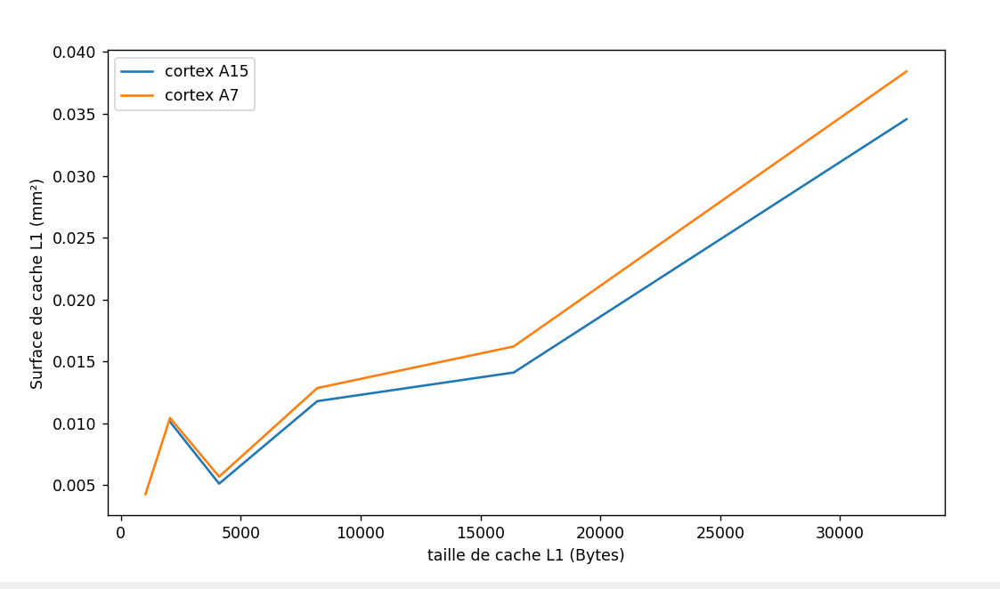
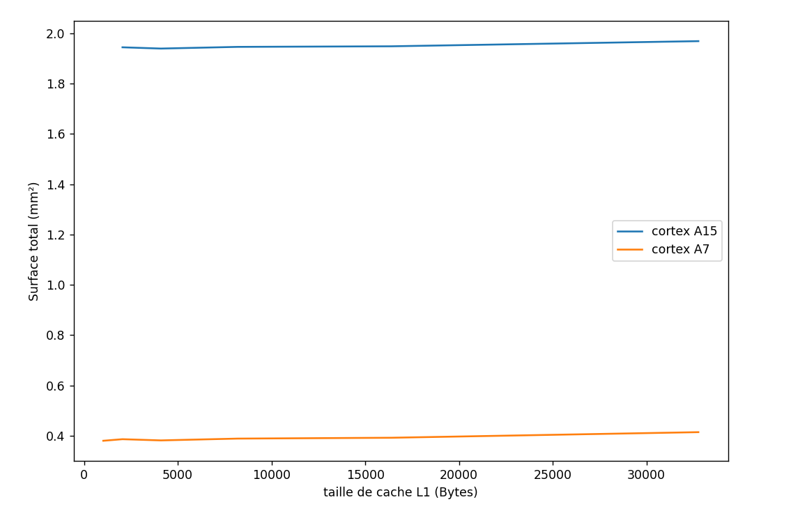
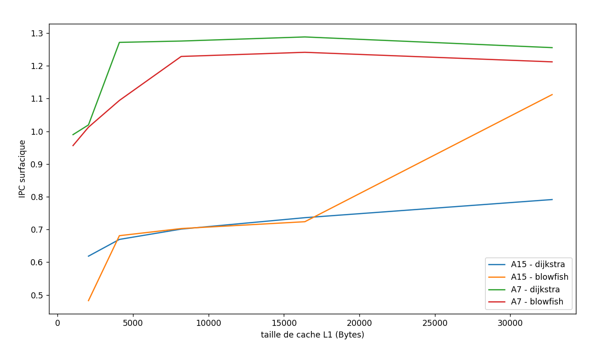
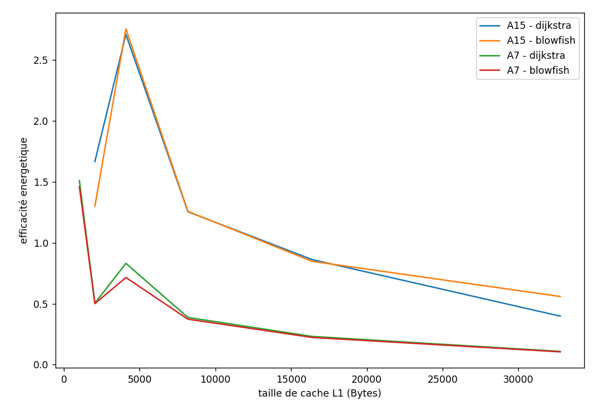

## Question 6

Dans le fichier cache.cfg initial, présent dans le repertoire du cours, on a les informations par défaut suivantes : 
>-size (bytes) 524248       (ligne 10) 
>-block size (bytes) 32     (ligne 17)
>-associativity 8           (ligne 23)
>-technology (u) 0.032      (ligne 33) (32nm)

## Question 7

On va adapter 4 fichiers de configurations pour simuler respectivement les surfaces :

* d'un cache L1 du cortexA15 
* d'un cache L1 du cortexA7
* du cache L2 du cortexA15
* du cache L2 du cortexA7

en simulant ces différentes configurations avec cacti on a les résultats suivants (dans les fichiers A15L1outputs, A7L1outputs, A15L2outputs, A7L2outputs)

|                             | **A15L1 outputs** | **A7L1 outputs** | **A15L2 outputs** | **A7L2 outputs** |
|-----------------------------|-------------------|------------------|-------------------|------------------|
| Data array: Area (mm2):     | 0.0290487         | 0.0290487        | 0.325227          | 0.332022         |
| Tag array: Area (mm2):      | 0.00411185        | 0.00793606       | 0.0579243         | 0.0983835        |
| Surface total (somme) (mm2) | 0.03316055        | 0.03698476       | 0.3831513         | 0.4304055        |

Comme on a 2 caches L1 par cortex on multiplie par deux la surface de cache L1 pour avoir le pourcentage de surface occupé par les caches L1.
>Pour le A15 la surface totale vaut 2mm2 (énnoncé), donc les caches L1 occupent $2 \frac{0.03316055	}{2} = 3.3$% de la surface totale
>Pour le A7 la surface totale vaut 0.45mm2 (énnoncé), donc les caches L1 occupent $2 \frac{0.03698476}{0.45} = 16,4$% de la surface totale

## Question 8

Pour chaque cortex, on modifie le fichier de configuration de cache L1 en faisant varier la taille de cache de 2^0 à 2^5 kB, et on récupère la nouvelle taille de ce cache


<div style="text-align:center;">
  
</div>

On constate que la surface des caches augmente avec la taille de cache. Cependant cette augmentation est négligeable comme le montre le graphique ci-dessous de la surface totale en fonction de la taille de cache L1.

<div style="text-align:center;">
  
</div>

Rq: pour avoir la surface totale on sait que dans la question précedente les surfaces totales étaient de 2mm² et 0.45mm² et on a calculé la surface des caches L1 donc on a la nouvelle surface totale avec : 
$$NewTotalArea = PrevTotalArea - PrevL1Area + NewL1Area$$


## Question 9

Il suffit de récupérer les lignes sim_IPC dans les simulations de dijkstra et de blowfish avec différentes tailles de cacheL1 et pour les deux cortex (cf Q4 et Q5) puis utiliser les surfaces notés dans le fichier python ```./cact-simulations/surface_par_taille.py```

<div style="text-align:center;">
  
</div>

## Question 10

Il suffit de multiplier la fréquence (maximale) par la puissance consommée par MHz : 

$ PuissanceA7 = 1000 [MHz]  *  0.10 [mW/MHz] = 100 mW $
$ PuissanceA15 = 2500 [MHz]  *  0.20 [mW/MHz] = 500 mW $


## Question 11

On procède comme à la question 9, en récupérant les données de consommation d'énergie dans les outputs données par cacti avec les caches L1 des deux processeurs.
Pour récupérer la consommation de puissance on somme les différents champs : 

>Leakage Power Closed Page (mW):
>Leakage Power Open Page (mW): 
>Leakage Power I/O (mW): 
>Refresh power (mW): 
>(in Data array) __ Total leakage read/write power of a bank (mW):
>(in Tag array) __ Total leakage read/write power of a bank (mW):

On récupère ces données de puissances dans les outputs cacti (fichier A7-0.txt... A7-6.txt, A15-1.txt...A15-6.txt) et on les somme avec le script ```recupPowerData.py```. Remarque : on a pas pris en compte les benchmark mais seulement les configuration de cache pour simuler la consommation de puissance, en réalité le benchmark a surement un impacte sur ces valeurs.

On obtiens pour la configuration du A7 et celle du A15 respectivement les consommations 4.453 mW et 3.4569880504 mW.

On utilise les IPC de la question 9 et en divisant par les consommations on obtient le graphique suivant :
<div style="text-align:center;">
  
</div>


##Question 12

On va se baser sur les graphiques d'efficacité surfacique (question 9) et d'efficacité énergétique (question 11).

On constate que l'efficacité energétique avec A15 est systématiquement meilleur qu'avec A7, (environ 2 fois meilleur sauf pour une taille de L1 de 4 kB où il y'a un facteur 5).
Mais que l'efficacité surfacique avec A7 est systématiquement meilleur qu'avec A15  (environ 2 fois meilleur également sauf pour une taille de 32 kB avec blowfish ou l'écart devient plus négligeable).

Dans tous les cas, il est intéressant de choisir un cache L1 de 4 kB car cette taille maximize l'efficacité energétique.

Cette taille de cache L1 étant choisie, on gagne beaucoup en efficacité énergétique en choisissant le A15 (x5 par rapport au A7), alors que l'efficacité surfacique n'est moins bonne que d'un facteur 2.

D'un point de vue objectif, il serait raisonnable de choisir le A15 avec un cache L1 de 4kB. Cependant du point de vue du constructeur, les coûts engendrés par une surface plus importante sont extrêmement importants c'est pourquoi nous ne sommes pas sûre que le choix précédent soit nécessairement le plus judicieux.


