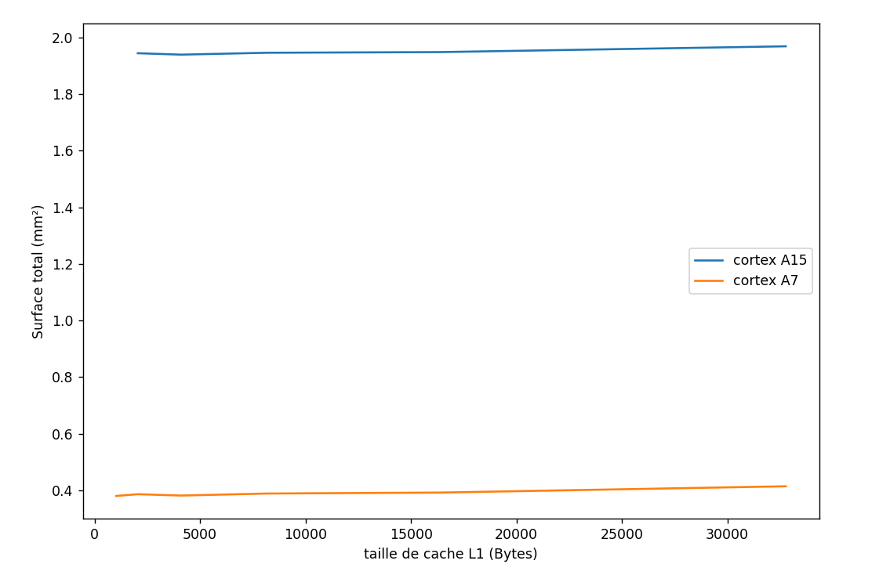

## Question 6

Dans le fichie cache.cfg initial, present dans le repertoire du cours, on a les informations par défaut suivantes : 
>-size (bytes) 524248       (ligne 10) 
>-block size (bytes) 32     (ligne 17)
>-associativity 8           (ligne 23)
>-technology (u) 0.032      (ligne 33) (32nm)

## Question 7

On va adapté 4 fichier de configurations pour simuler respectivement les surfaces :

* d'un cache L1 du cortexA15 
* d'un cache L1 du cortexA7
* du cache L2 du cortexA15
* du cache L2 du cortexA7

en simulant ces différentes configuration avec cacti on a les résultats suivants (dans les fichiers A15L1outputs, A7L1outputs, A15L2outputs, A7L2outputs)

|                             | **A15L1 outputs** | **A7L1 outputs** | **A15L2 outputs** | **A7L2 outputs** |
|-----------------------------|-------------------|------------------|-------------------|------------------|
| Data array: Area (mm2):     | 0.0290487         | 0.0290487        | 0.325227          | 0.332022         |
| Tag array: Area (mm2):      | 0.00411185        | 0.00793606       | 0.0579243         | 0.0983835        |
| Surface total (somme) (mm2) | 0.03316055        | 0.03698476       | 0.3831513         | 0.4304055        |

Comme on a 2 caches L1 par cortex on multiplie par deux la surface de cache L1 pour avoir le pourcentage de surface occupé par les caches L1.
>Pour le A15 la surface totale vaut 2mm2 (énnoncé), donc les caches L1 occupent $2 \frac{0.03316055	}{2} = 3.3$% de la surface totale
>Pour le A7 la surface totale vaut 0.45mm2 (énnoncé), donc les caches L1 occupent $2 \frac{0.03698476}{0.45} = 16,4$% de la surface totale

## Question 8

Pour chaque cortex, on modifie le fichier de configuration de cache L1 en faisant varier la taille de cache de 2^0 à 2^5 kB, et on récupère la nouvelle taille de ce cache


<div style="text-align:center;">
  
</div>

On constate que la surface des caches augmente avec la taille de cache. Cependant cette augmentation est négligeable comme le montre le graphique ci-dessous de la surface totale en fonction de la taille de cache L1.

<div style="text-align:center;">
  
</div>

Rq: pour avoir la surface totale on sait que dans la question precedente les surfaces totales était de 2mm2 et 0.45mm2 et on a calculé la surface des caches L1 donc on a la nouvelle surface totale avec : 
$$NewTotalArea = PrevTotalArea - PrevL1Area + NewL1Area$$


## Question 9

Il suffit de récupérer les lignes sim_IPC dans les simulation de dijkstra et de blowfish avec différentes tailles de cacheL1 et pour les deux cortex (cf Q4 et Q5) puis utiliser les surfaces notés dans le fichier python ```./cact-simulations/surface_par_taille.py```

<div style="text-align:center;">
  
</div>