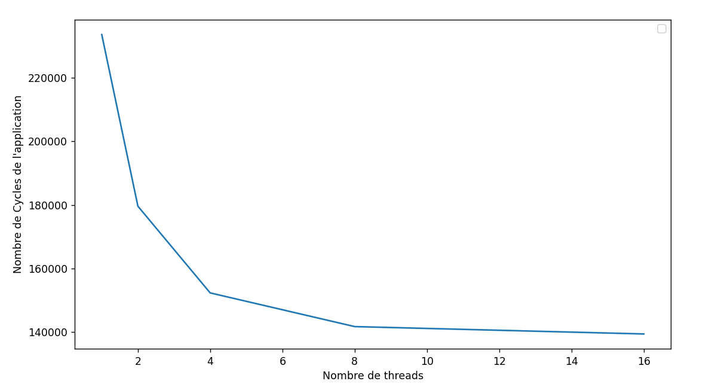

# Rapport TP5

## Question 1

Dans le cas de la multiplication de la matrice A par la matrice B sur n threads, chaque lignes de la matrice A congruant
à p modulo n sont placées dans le cache du processus p. Comme la matrice A n'est pas modifié mais simplement lu, il n'y a pas de 
problème de cohérence (elle possède l'état Shared). La matrice B doit être accessible par tous les processus, comme il n'y a pas de mémoire cache 
L2 commune à tous les coeurs (d'après la figure 20), la matrice B doit être disponible dans le cache associée
à chaque coeur. Encore une fois, cette matrice est seulement lu, elle n'est pas modifié, elle à donc l'état Shared (pas de problème 
de cohérence de cache). Enfin, la matrice résultat C doit être commune à tous les coeurs, mais il n'y à pas de problème de concurrence de cache, 
puisque les lignes de la matrice C congruent à p modulo n ne sont modifié que par le processus p. 

## Question 2

Les problèmes...

## Question 3

parser.add_option("--l1d_size", type="string", default="64kB")
parser.add_option("--l1i_size", type="string", default="32kB")
parser.add_option("--l2_size", type="string", default="2MB")

parser.add_option("--l1d_assoc", type="int", default=2)
parser.add_option("--l1i_assoc", type="int", default=2)
parser.add_option("--l2_assoc", type="int", default=8)

parser.add_option("--cacheline_size", type="int", default=64)

|                        | **L1-données** | **L1-instructions** | **L2**  |
|------------------------|----------------|---------------------|---------|
| **Taille**             | 64kB           | 32kB                | 2MB     |
| **associativité**      | 2              | 2                   | 8       |
| **taille de la ligne** | 64             | 64                  | 64      |


## Question 4

Pour cette question et pour les (3) suivantes on fixe la taille de la matrice à `m=25` pour éviter d'avoir des temps de simulation trop longs et car avec 50 on a des erreur segmentation fault pour 2 et 16 threads. Avec m=25 on a quand même un nombre d'opérations et donc d'instructions assez significatif.

Pour un nombre de thread n = 1, 2, 4, 8, 16 (et un nombre de coeur équivalent comme l'impose le mode se), avec la commande suivante:
```
$GEM5/configs/example/se.py --cpu-type=arm_detailed --caches -<n> 8 -c test_omp -o "<n> 200"
```
On obtient les résultats suivants pour le nombre de cycles des différents CPU:

|     	| CPU0   	| CPU1   	| CPU2   	| CPU3   	| CPU4   	| CPU5   	| CPU6   	| CPU7   	| CPU8 	| CPU9 	| CPU10 	| CPU11 	| CPU12 	| CPU13 	| CPU14 	| CPU15 	|
|-----	|--------	|--------	|--------	|--------	|--------	|--------	|--------	|--------	|------	|------	|-------	|-------	|-------	|-------	|-------	|-------	|
| n=1 | 233586 | x | x | x | x | x | x | x | x | x | x | x | x | x | x | x |
| n=2 | 179582 | 74404 | x | x | x | x | x | x | x | x | x | x | x | x | x | x |
| n=4 | 152306 | 47074 | 46568 | 46207 | x | x | x | x | x | x | x | x | x | x | x | x |
| n=8 | 141702 | 36170 | 35664 | 35160 | 34613 | 33981 | 33513 | 33158 | x | x | x | x | x | x | x | x |
| n=16 | 139384 | 33836 | 33330 | 32829 | 32228 | 31720 | 31208 | 30736 | 29596 | 29025 | 28324 | 27372 | 26628 | 26077 | 25143 | 24714 |


C'est toujours le processus 0 qui effectue le plus de cycles. Cela est dûe à ... .Comme son nombre de cycle est le plus important et que ...

## Question 5
Le nombre de cycles d’exécution de l’application pour les différentes configuration est égale au nombre de cycles du premier processeur


<div style="text-align:center;">
  
</div>


## Question 6

Pour calculer le speedup on va calculer le ratio de nombre de cycles totales avec plusieurs threads comparé à avec un seul. On a les résultats suivants

|         	| n=1 	| n=2   	| n=4   	| n=8   	| n=16  	|
|----------	|-----	|-------	|-------	|-------	|-------	|
| speedup par rapport à 1 seul thread 	| 1   	| 1.300 	| 1.534 	| 1.648 	| 1.676 	|


## Question 7

On récupère le nombre d'instruction `sim_insts` à la ligne 12, puis en divisant ce nombre d'instruction par le nombre de cycle de l'application, on a l'IPC maximum pour chaque config

|         	| n=1 	| n=2   	| n=4   	| n=8   	| n=16  	|
|----------	|-----	|-------	|-------	|-------	|-------	|
| IPC    	| 1.174 | 1.527 	| 1.800 	| 1.935 	| 1.967 	|


## Question 8
On voit que le nombre de cycle de l'application diminue avec le nombre de threads (cf q5) ce qui est logique car on répartie le travail sur plusieurs CPUs pour effectuer plus d'instructions à chaque cycle. Dans le même temps, le nombre d'instruction totale augmente car des instructions supplémentaires entre le thread principale et les threads supplémentaires s'ajoutent. Cela explique pourquoi le ratio $\frac{nb\_insts}{nb\_cycles}$ augmente et donc que l'IPC augmente.

