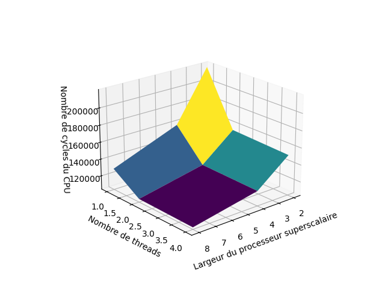
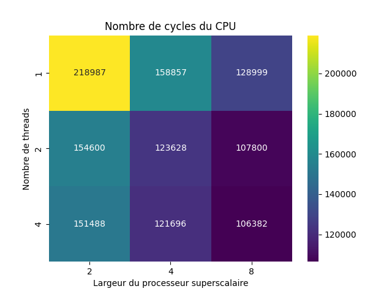
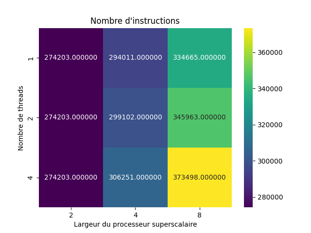

# Rapport TP5

## Question 1

Dans le cas de la multiplication de la matrice A par la matrice B sur n threads, chaque lignes de la matrice A congruant
à p modulo n sont placées dans le cache du processus p. Comme la matrice A n'est pas modifié mais simplement lu, il n'y a pas de 
problème de cohérence (elle possède l'état Shared). La matrice B doit être accessible par tous les processus, comme il n'y a pas de mémoire cache 
L2 commune à tous les coeurs (d'après la figure 20), la matrice B doit être disponible dans le cache associée
à chaque coeur. Encore une fois, cette matrice est seulement lu, elle n'est pas modifié, elle à donc l'état Shared (pas de problème 
de cohérence de cache). Enfin, la matrice résultat C doit être commune à tous les coeurs, mais il n'y à pas de problème de concurrence de cache, 
puisque les lignes de la matrice C congruent à p modulo n ne sont modifié que par le processus p. 

Si le cache n'est pas assez grand pour toute la matrice B, cette elle devra être chargée progressivement par colonne dans le cache de de chaque coeur.

## Question 2

Le fichier O3CPU.py est un fichier de configuration pour un processus super scalaire out-of-order (d'où le nom O3), on retrouve différents paramètres rencontrés en cours:

| fetchWidth | decodeToFetchDelay | commitToFetchDelay | issueWidth | trapLatency |
|-----------|-----------|-----------|-----------|-----------|
| 8| 1 | 1 | 8 | 13 |

- **fetchWidth** : fetchWidth correspond au nombres d'instructions pouvant être récupérées en parallèles 
- **decodeToFetchDelay** : Il s'agit du nombre de cycle d'horloge entre l'étape de décodage et l'étape de fetch dans la pipline d'exécution. On s'attendrait plutôt à avoir une instruction *FetchToDecodeDelay* puisque généralement, les pipelines fetch les instructions pour ensuite les décoder.
-**commitToFetchDelay** : Le commit correspond à la validation des résultats d'une instruction (qui pourraient être invalidé par une erreur de prédiction de branchement, une dépendance des données...). *commitToFetchDelay* correspond donc au délai en cycle d'horloge entre le moment où les données sont confirmées et le moment où elles peuvent être récupérées depuis la mémoire 
- **issueWidth** : issueWidth correspond aux nombres d'instruction pouvant être envoyées simulatnément depuis le décodage vers l'étage suivant du pipeline (unité d'exécution ou renommage).
- **trapLatency** : un trap c'est un interruption, typiquement quand il y a une erreur, une division par zéro, un *interrupt handler* s'occupent de ce genre d'événement. ici trapLentecy = 13, ce qui signifie que l'on considère que 13 cycles sont perdus lors d'un trap

## Question 3

parser.add_option("--l1d_size", type="string", default="64kB")
parser.add_option("--l1i_size", type="string", default="32kB")
parser.add_option("--l2_size", type="string", default="2MB")

parser.add_option("--l1d_assoc", type="int", default=2)
parser.add_option("--l1i_assoc", type="int", default=2)
parser.add_option("--l2_assoc", type="int", default=8)

parser.add_option("--cacheline_size", type="int", default=64)

|                        | **L1-données** | **L1-instructions** | **L2**  |
|------------------------|----------------|---------------------|---------|
| **Taille**             | 64kB           | 32kB                | 2MB     |
| **associativité**      | 2              | 2                   | 8       |
| **taille de la ligne** | 64             | 64                  | 64      |


## Question 4

Pour cette question et pour les (3) suivantes on fixe la taille de la matrice à `m=25` pour éviter d'avoir des temps de simulation trop longs et car avec 50 on a des erreurs segmentation fault pour 2 et 16 threads. Avec m=25 on a quand même un nombre d'opérations et donc d'instructions assez significatif.

Pour un nombre de thread n = 1, 2, 4, 8, 16 (et un nombre de coeur équivalent comme l'impose le mode se), avec la commande suivante:
```
$GEM5/configs/example/se.py --cpu-type=arm_detailed --caches -<n> 8 -c test_omp -o "<n> 200"
```
On obtient les résultats les outputs de GEM5 et on les notes dans le dosser partie3 de la forme `stats<n>.txt`. En exécutant `recupOutputs.py` on obtient les nombres de cycles suivants:

|     	| CPU0   	| CPU1   	| CPU2   	| CPU3   	| CPU4   	| CPU5   	| CPU6   	| CPU7   	| CPU8 	| CPU9 	| CPU10 	| CPU11 	| CPU12 	| CPU13 	| CPU14 	| CPU15 	|
|-----	|--------	|--------	|--------	|--------	|--------	|--------	|--------	|--------	|------	|------	|-------	|-------	|-------	|-------	|-------	|-------	|
| n=1 | 233586 | x | x | x | x | x | x | x | x | x | x | x | x | x | x | x |
| n=2 | 179582 | 74404 | x | x | x | x | x | x | x | x | x | x | x | x | x | x |
| n=4 | 152306 | 47074 | 46568 | 46207 | x | x | x | x | x | x | x | x | x | x | x | x |
| n=8 | 141702 | 36170 | 35664 | 35160 | 34613 | 33981 | 33513 | 33158 | x | x | x | x | x | x | x | x |
| n=16 | 139384 | 33836 | 33330 | 32829 | 32228 | 31720 | 31208 | 30736 | 29596 | 29025 | 28324 | 27372 | 26628 | 26077 | 25143 | 24714 |


C'est toujours le processus 0 qui effectue le plus de cycles. Cela est certainement dûe à l'initialisation des matrices A et B et la création des threads. 
En effet, regardons pour n=2, CPU1 effectue environ 74 000 cycles, si on retire ce nombre de cycle au CPU0 qui effectue environ autant de cycle pour calculer, il reste environ $179582 - 74404 = 105178$ cycles effectuer par le CPU0 pour initialiser les matrices et thread. Pour n=4, $152306 - 47074=105232$ cycles pour initaliser matrices et threads, etc...


 Comme le nombre de cycle du CPU 0 est le plus important et que, les CPUs travaillent en parallèle dans une architecture multiprocesseurs superscalaire, on en déduit que le temps que le CPU 0 fassent tous ces cycles, les autres CPU auront finis leur calcule, et donc le nombre totale de cycle de l'application se résume à celui du CPU 0.

## Question 5
Le nombre de cycles d’exécution de l’application pour les différentes configuration est égale au nombre de cycles du premier processeur


<div style="text-align:center;">
  
</div>


## Question 6

Pour calculer le speedup on va calculer le ratio de nombre de cycles totales avec plusieurs threads comparé à avec un seul. On a les résultats suivants

|         	| n=1 	| n=2   	| n=4   	| n=8   	| n=16  	|
|----------	|-----	|-------	|-------	|-------	|-------	|
| speedup par rapport à 1 seul thread 	| 1   	| 1.300 	| 1.534 	| 1.648 	| 1.676 	|


## Question 7

On récupère le nombre d'instruction `sim_insts` à la ligne 12, puis en divisant ce nombre d'instruction par le nombre de cycle de l'application, on a l'IPC maximum pour chaque config

|         	| n=1 	| n=2   	| n=4   	| n=8   	| n=16  	|
|----------	|-----	|-------	|-------	|-------	|-------	|
| IPC    	| 1.174 | 1.527 	| 1.800 	| 1.935 	| 1.967 	|


## Question 8
On voit que le nombre de cycle de l'application diminue avec le nombre de threads (cf q5) ce qui est logique car on répartie le travail sur plusieurs CPUs pour effectuer plus d'instructions à chaque cycle. Dans le même temps, le nombre d'instruction totale augmente car des instructions supplémentaires entre le thread principale et les threads supplémentaires s'ajoutent. Cela explique pourquoi le ratio $\frac{nb\_insts}{nb\_cycles}$ augmente et donc que l'IPC augmente.


# Partie 4

## Question 9 
Les simulations pour un nombre de threads supérieur à 4 (ie pour 8 et 16 threads) n'ont pas pu être faîtes, en effet une erreur de segmentation était renvoyée, et ce même pour une taille de matrice relativement petite (25*25). Nous nous contenterons des valeurs 1, 2 et 4 pour ce qui est du nombre de threads, et des valeurs 2, 4 et 8 pour la largeur du CPU. On obtient les valeurs suivantes pour le nombre de cycles en fontion des paramètres, les résultats seront chaque fois présentés sous la forme d'un graphe 3D et une heatmap. À noter que pour des raisons de clarté de visualisation, le graphe 3D suivant est tourné de 180° selon l'axe z. Les valeur *nombre de thread* et *largeur du CPU* sont ainsi affichées dans l'ordre décroissant.

La commande utilisée pour lancer les simulation est la suivante : 
```
$GEM5/build/ARM/gem5.fast $GEM5/configs/example/se.py -w 2 -n 4 -c test_omp -o "4 25"
```
Cette commande lance une simulation pour un processeur superscalaire de largeur 2 et pour 4 threads. Tous les calculs matriciels simulés le seront pour des matrice de taille 25*25. 


<div style="text-align:center;">
  
  
</div>


On remarque que le nombre de cycles simulés décroit en fonction de l'augmentation du nombre de threads ou du nombre de voies. Cela est du au fait que plus de composants sont mis en jeu à chaque cycle, pouvant ainsi effectuer plus de d'instruction par cycle. On a ainsi besoin de moins de cycles pour effectuer la la même tâche.

## Question 10
On obtient les résultats suivants pour le SpeedUp. La référence prise est la simulation effectuée pour 1 thread et une largeur de 2.

<div style="text-align:center;">
    <tr>
        <td></td>
        <td></td>
    </tr>
</div>

Attention, le graphe 3D est "retourné" par rapport au graphe 3D de la question précédente.

## Question 11

On calcule l'IPC de la même manière que dans la question précédente, et cela nous donne les résultats suivants :

<div style="text-align:center;">
  
  
</div>

On remarque que margré une légère augmentation du nombre total d'instructions avec l'augmentation de la largeur et du nombre de threads (cf ci-dessous), l'IPC augmente suffisamment pour faire baisser le nombre de cycle total.

<div style="text-align:center;">
  
  
</div>


## Question 12

Malgré l'absence de données pour un nombre de threads supérieur à 4, on peut tirer des conclusions. Le SpeedUp augmente à la fois avec l'augmentation du nombre de threads et avec la largeur du processeur superscalaire. On remarque aussi que nombre total d'instruction augmente peu en fonction du nombre de threads, mais augmente plus fortement avec l'augmentation du nombre de voies. Cela est sûrement dû à des coûts de communication supplémentaires induits par l'augmentation de la taille du processeur. Finalement l'IPC augmente avec le nombre de voies et le nombre de threads malgré cette augmentation du nombre d'instructions. Ainsi la parallélisation est rentable, elle permet de compenser l'augmentation du nombre d'instructions.

## Question 13

La contrainte imposée est l'efficacité surfacique, l'architecture CMP étant à base de coeurs Cortex A15 (étudiés au TP4), on peut s'appuyer sur les résultats fournis par Cacti concernant l'efficacité surfacique. 

<div style="text-align:center;">
  
</div>

Ce graphe - issu du TP précédent - ne donne pas IPC Surfacique pour un cache L1 de 64kB, utilisé dans les questions précédentes, on admettra donc que les courbes poursuivent les mêmes tendances. On constate donc que l'efficacité surfacique augmente avec la taille du cache L1, il n'est donc pas intéressant de prendre un cache L1 plus petit pour économiser de la place. 

Dans la section précédente, on a constater des performances croissantes avec le nombre de threads et la largeur des voies. Néanmoins, cette augmentation se répercute directement sur la taille du CPU. Partons du principe que la surface augmente proportionnellement avec le nombre de threads. De même, augmenter le nombre de voie nécessite une architecture pipeline plus complexe, et donc plus encombrante, nous ferons donc l'hypothèse que la taille d'un coeur est proportionelle au nombre de voie. 

<div style="text-align:center;">
  
</div>

On constate que l'architecture a 2 voies et 1 thread est la plus performante en terme d'efficacité surfacique. En réalité, l'hyptohèse selon laquel la surface du processeur est proportionnelle au nombre de thread et au nombre de voie est grossière, un processeur à 8 threads et 8 voies ne prend sûrement pas 32 fois plus de place qu'un processeur à 1 thread et deux voies. Ce raisonnement permet tout de même d'estimer l'efficacité surfacique d'un processeur si on sait avec précision l'encombrement induit par une augmentation du nombre de voies. Si on relache la proportionnalité par rapport au nombre de voies, on obtient le résultat suivant : 

<div style="text-align:center;">
  
</div>

Dans tous les cas, on constate que pour garantir une efficacité surfacique maximale, il faut une architecture à 1 seul thread.