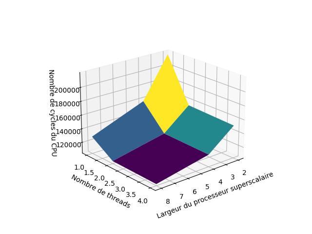
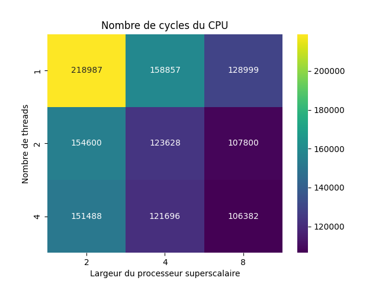
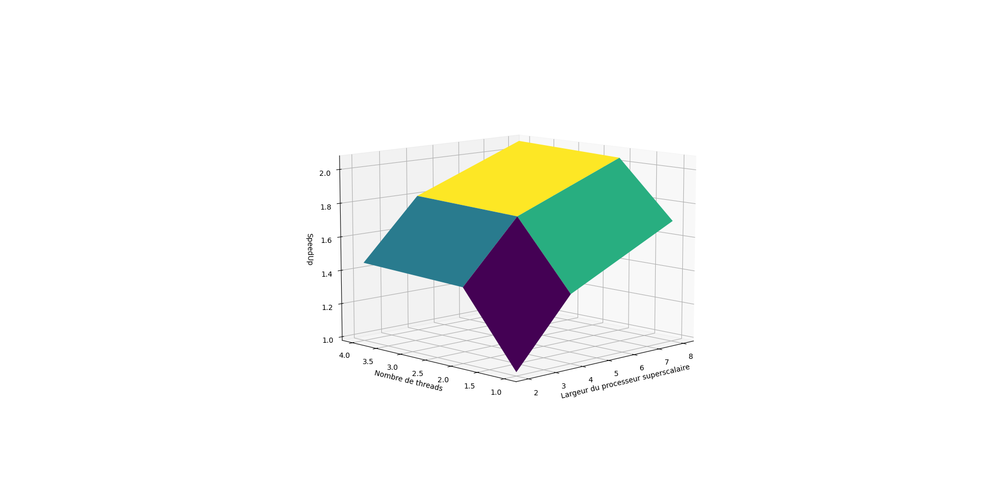
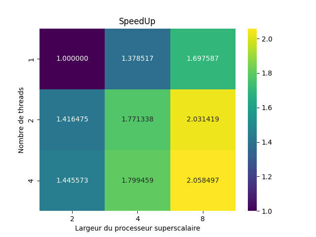
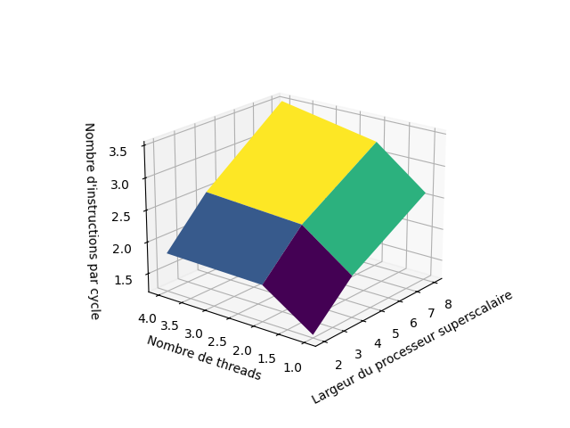
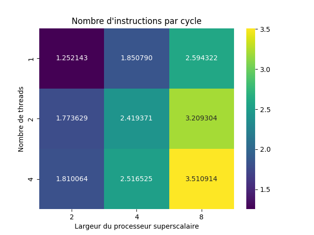
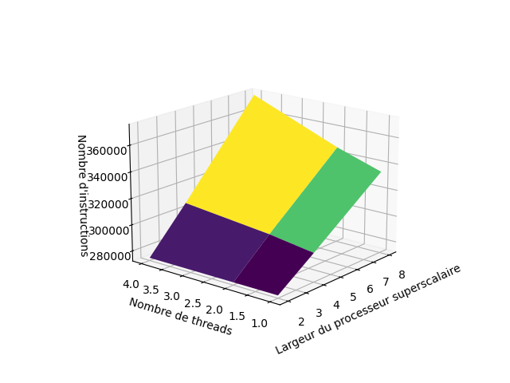
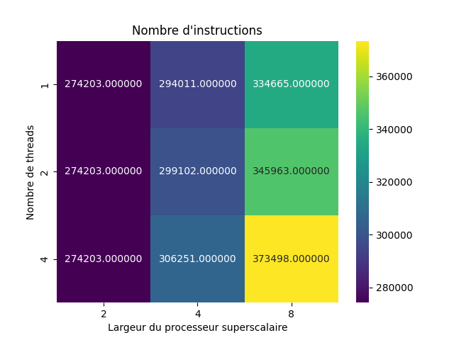

## Partie 4

**Q9 : **
Les simulations pour un nombre de threads supérieur à 4 (ie pour 8 et 16 threads) n'ont pas pu être faîtes, en effet une erreur de segmentation était renvoyée, et ce même pour une taille de matrice relativement petite (25*25). Nous nous contenterons des valeurs 1, 2 et 4 pour ce qui est du nombre de threads, et des valeurs 2, 4 et 8 pour la largeur du CPU. On obtient les valeurs suivantes pour le nombre de cycles en fontion des paramètres, les résultats seront chaque fois présentés sous la forme d'un graphe 3D et une heatmap. À noter que pour des raisons de clarté de visualisation, le graphe 3D suivant est tourné de 180° selon l'axe z. Les valeur *nombre de thread* et *largeur du CPU* sont ainsi affichées dans l'ordre décroissant.

La commande utilisée pour lancer les simulation est la suivante : 
```
$GEM5/build/ARM/gem5.fast $GEM5/configs/example/se.py -w 2 -n 4 -c test_omp -o "4 25"
```
Cette commande lance une simulation pour un processeur superscalaire de largeur 2 et pour 4 threads. Tous les calculs matriciels simulés le seront pour des matrice de taille 25*25. 


<div style="text-align:center;">
  
  
</div>


On remarque que le nombre de cycles simulés décroit en fonction de l'augmentation du nombre de threads ou du nombre de voies. Cela est du au fait que plus de composants sont mis en jeu à chaque cycle, pouvant ainsi effectuer plus de d'instruction par cycle. On a ainsi besoin de moins de cycles pour effectuer la la même tâche.

**Q10 : **
On obtient les résultats suivants pour le SpeedUp. La référence prise est la simulation effectuée pour 1 thread et une largeur de 2.

<div style="text-align:center;">
    <tr>
        <td></td>
        <td></td>
    </tr>
</div>

Attention, le graphe 3D est "retourné" par rapport au graphe 3D de la question précédente.

**Q11 : **

On calcule l'IPC de la même manière que dans la question précédente, et cela nous donne les résultats suivants :

<div style="text-align:center;">
  
  
</div>

On remarque que margré une légère augmentation du nombre total d'instructions avec l'augmentation de la largeur et du nombre de threads (cf ci-dessous), l'IPC augmente suffisamment pour faire baisser le nombre de cycle total.

<div style="text-align:center;">
  
  
</div>


**Q12 : **

Malgré l'absence de données pour un nombre de threads supérieur à 4, on peut tirer des conclusions. Le SpeedUp augmente à la fois avec l'augmentation du nombre de threads et avec la largeur du processeur superscalaire. On remarque aussi que nombre total d'instruction augmente peu en fonction du nombre de threads, mais augmente plus fortement avec l'augmentation du nombre de voies. Cela est sûrement dû à des coûts de communication supplémentaires induits par l'augmentation de la taille du processeur. Finalement l'IPC augmente avec le nombre de voies et le nombre de threads malgré cette augmentation du nombre d'instructions. Ainsi la parallélisation est rentable, elle permet de compenser l'augmentation du nombre d'instructions.