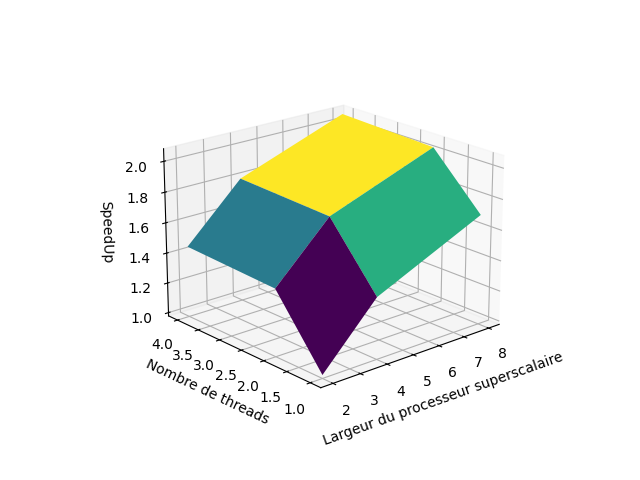

## Partie 4

**Q9 : **
Les simulations pour un nombre de threads supérieur à 4 (ie pour 8 et 16 threads) n'ont pas pu être faîtes, en effet une erreur de segmentation était renvoyée, et ce même pour une taille de matrice relativement petite (25*25). Nous nous contenterons des valeurs 1, 2 et 4 pour ce qui est du nombre de threads, et des valeurs 2, 4 et 8 pour la largeur du CPU. On obtient les valeurs suivantes pour le nombre de cycles en fontion des paramètres, les résultats seront chaque fois présentés sous la forme d'un graphe 3D et une heatmap. À noter que pour des raisons de clarté de visualisation, le graphe 3D suivant est tourné de 180° selon l'axe z. Les valeur *nombre de thread* et *largeur du CPU* sont ainsi affichées dans l'ordre décroissant.

  
  

On remarque que le nombre de cycles simulés décroit en fonction de l'augmentation du nombre de threads ou du nombre de voies. Cela est du au fait que plus de composants sont mis en jeu à chaque cycle, pouvant ainsi effectuer plus de d'instruction par cycle. On a ainsi besoin de moins de cycles pour effectuer la la même tâche.

**Q10 : **
On obtient les résultats suivants pour le SpeedUp. La référence prise est la simulation effectuée pour 1 thread et une largeur de 2.

    <tr>
        <td></td>
        <td></td>
    </tr>

Attention, le graphe 3D est "retourné" par rapport au graphe 3D de la question précédente.

**Q11 : **

On calcule l'IPC de la même manière que dans la question précédente, et cela nous donne les résultats suivants :

  
  

